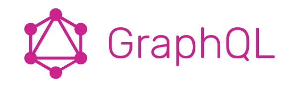

# GraphQL

1.  Over-fetching
    <pre>
       /users/ GET -> Database에서 필요없는 부분을 제외하고, 필요한 부분만 호출하여 활용한다.

 </pre>

2.  Under-fetching
    <pre>
       하나의 Data를 얻기 위해 여러 URL을 호출해야 하는 문제를 해결한다.
    </pre>
